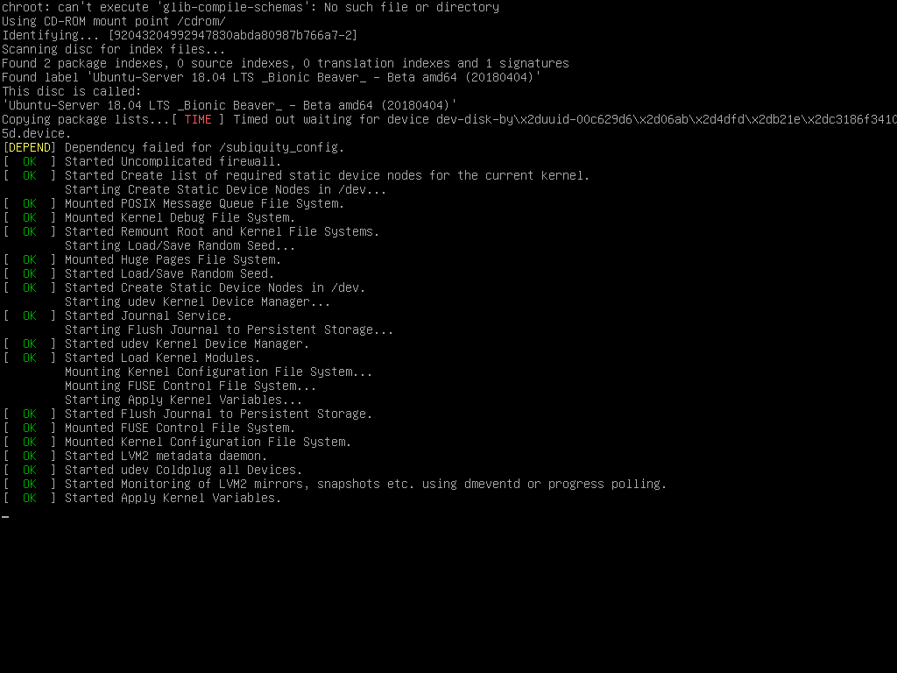

# Configurando Servidor Ubuntu 25.10 



Modelo de configuração de um Ubuntu server com instâncias para: servidor DHCP, duas NICs, duas aplicações em servidor web com Apache e Nginx, concatenados ao PostgreSQL e MariaDB, consecutivamente, servidor de arquivos com Samba e nuvem pessoal utilizando o NextCloud. As aplicações e a nuvem ficam disponíveis via acesso web por meio de túneis Cloudflare. É recomendado o estudo externo de cada tópico singular para maximizar o domínio sobre os temas.

Após o término da configuração inicial do servidor, para conseguir instalar todas as dependências necessárias, é preciso do `curl`, ele é um programa que permite baixar ou enviar dados usando protocolos de rede (HTTP, HTTPS...). Então, caso já não tenha, instale com:

```bash
sudo apt update && sudo apt upgrade -y
sudo apt install curl -y
```

Após isso, baixe todas as dependências:

```bash
curl -L https://raw.githubusercontent.com/aarthurcreis/ServidorUbuntu/main/install.sh | bash
```

<br>

## Configurar servidor DHCP
### Descobrir nome da interface LAN

```bash
ip addr

# exemplo: "enp0s3", IP do servidor: "192.168.0.110"

```


### Configurar interface do DHCP

```bash
sudo nano /etc/default/isc-dhcp-server
```

No arquivo:

```bash
INTERFACESv4="enp0s3" # altere conforme sua interface
```

### Configurar escopo DHCP

```bash
sudo nano /etc/dhcp/dhcpd.conf
```

Exemplo (alterar com IP do servidor):

```bash
subnet 192.168.0.0 netmask 255.255.255.0 {
  range 192.168.0.100 192.168.0.200; # intervalo de endereços a atribuir
  option routers 192.168.0.1; # gateway
  option domain-name-servers 8.8.8.8, 8.8.4.4; # servidores DNS
  option broadcast-address 192.168.0.255; # broadcast
}
```

### Iniciar e habilitar serviço DHCP

```
sudo systemctl enable isc-dhcp-server
sudo systemctl start isc-dhcp-server
sudo systemctl status isc-dhcp-server
```

### Verificar caso dê erro (checar logs)

```bash
sudo dhcpd -t -cf /etc/dhcp/dhcpd.conf
ls -l /etc/dhcp/dhcpd.conf
sudo chmod 644 /etc/dhcp/dhcpd.conf
sudo chown root:root /etc/dhcp/dhcpd.conf
```
<br>

## Configurar placas de rede (no caso de duas)
### Exemplo (alterar conforme IP e placas):

```bash
  version: 2
  renderer: networkd
  ethernets:
    enp1s0:      # LAN
      dhcp4: no
      addresses: [192.168.0.10/24]
      routes:
        - to: 0.0.0.0/0
          via: 192.168.0.1
          on-link: true
    enp2s0:      # WAN
      dhcp4: true
      optional: true
```

### Testar conectividade

```bash
ip route get 8.8.8.8
# exemplo de saída:
# 8.8.8.8 via 192.168.0.10 dev enp2s0 src 192.168.0.11 uid 0
```
<br>

## Configurar aplicações web (Apache e Nginx)
### Configurar Apache

```bash
sudo systemctl start apache2
sudo systemctl enable apache2
systemctl status apache2 # verifica se subiu
```

### Colocar seus arquivos no diretório padrão

```bash
sudo cp -r /caminho/dos/seus/arquivos_php/* /var/www/html/
sudo chown -R www-data:www-data /var/www/html/
sudo chmod -R 755 /var/www/html/
```

### Testar PostgreSQL

```bash
sudo systemctl start postgresql
sudo systemctl enable postgresql
sudo systemctl status postgresql
```

### Testar PHP

```bash
sudo systemctl start php8.2-fpm  # ou a versão que você tiver
sudo systemctl enable php8.2-fpm
sudo systemctl status php8.2-fpm
```

<br>

### Configurar Nginx (engine x)

```bash
sudo systemctl start nginx
sudo systemctl enable nginx
sudo systemctl status nginx
```
### Certificar que MariaDB está rodando

```bash
sudo systemctl start mariadb
sudo systemctl enable mariadb
sudo systemctl status mariadb
```

### Configurar Nginx para processar PHP (exemplo em /etc/nginx/sites-available/default)

```bash
server {
    listen 8080; # mudar para não dar conflito com Apache
    server_name _;

    root /var/www/html_postgres;  # seu diretório com arquivos PHP PostgreSQL
    index index.php index.html index.htm;

    location / {
        try_files $uri $uri/ =404;
    }

    location ~ \.php$ {
        include snippets/fastcgi-php.conf;
        fastcgi_pass unix:/var/run/php/php8.2-fpm.sock;  # ajuste versão
    }

    location ~ /\.ht {
        deny all;
    }
}
```

### Testar configuração e reiniciar Nginx

```bash
sudo nginx -t
sudo systemctl reload nginx
```

<br>

## Configurar servidor de arquivos (Samba)
### Criar pasta de arquivos

```bash
sudo mkdir -p /srv/arquivos
sudo chown -R usuario1:usuario1 /srv/arquivos # substitua "usuario1" pelo seu usuário
sudo chmod -R 770 /srv/arquivos
```

### Criar usuário Samba

```bash
sudo adduser usuario1 
sudo smbpasswd -a usuario1
sudo smbpasswd -e usuario1
```

### Configurar compartilhamento

```bash
sudo nano /etc/samba/smb.conf
```

Adicione no final:

```ini
[Arquivos]
   path = /srv/arquivos
   browseable = yes
   read only = no
   valid users = usuario1
   force user = usuario1
```

### Reiniciar Samba

```
sudo systemctl restart smbd
sudo systemctl enable smbd
```

### Acessar do Windows

No Windows Explorer, digite:

```
\\192.168.0.110\Arquivos
```

Use o usuário e senha configurados (`usuario1`).<br><br>

## Configurando Nextcloud
### Configurar domínios confiáveis

```bash
sudo nano /var/snap/nextcloud/current/nextcloud/config/config.php
```

Edite a seção `trusted_domains`:

```php
'trusted_domains' =>
  array (
    0 => 'localhost',
    1 => '192.168.0.110', # IP do servidor
    2 => 'meudominio.com',
  ),
```

### Edite o arquivo de site do Nextcloud (ex: /etc/apache2/sites-available/nextcloud.conf)

Para não dar conflito com o Apache:

```bash
<VirtualHost *:8181> # troque aqui
    ServerAdmin webmaster@localhost
    DocumentRoot /var/www/nextcloud

    <Directory /var/www/nextcloud/>
        Options +FollowSymlinks
        AllowOverride All
        Require all granted
    </Directory>

    ErrorLog ${APACHE_LOG_DIR}/nextcloud_error.log
    CustomLog ${APACHE_LOG_DIR}/nextcloud_access.log combined
</VirtualHost>
```

### Reiniciar Nextcloud

```bash
sudo systemctl restart nextcloud
```

### Acessar via navegador

```
http://192.168.0.110:8181
```

ou pelo domínio configurado.

<br>

## Liberar as portas das aplicações no firewall
### Habilitar UFW

```bash
sudo ufw enable
sudo ufw default deny incoming
sudo ufw default allow outgoing
```

### Liberar portas específicas para os serviços

```bash
# Apache
sudo ufw allow 80/tcp

# Nginx
sudo ufw allow 8080/tcp

# Nextcloud
sudo ufw allow 8181/tcp

# SSH
sudo ufw allow 22/tcp
```

<br>

## Subir as aplicações e NextCloud nos túneis

### Fazer o mesmo para cada porta configurada:

```bash
cloudflared tunnel --url http://localhost:80 # no caso do Apache
```

Após isso, será gerado um link aleatório `.trycloudflare.com` que irá redirecionar quem acessar para a porta que foi aberta no servidor. Por ser um link grande e aleatório, pode ser recomendado o uso de um encurtador.

**[Artigo da Clouflare sobre os túneis](https://developers.cloudflare.com/cloudflare-one/networks/connectors/cloudflare-tunnel/)** <br>


<br>

# Comandos no Linux
Os `comandos` em qualquer distro servem para locomoção e configuração dentro sistema operacional. Desse modo, para utilizar a funcionalidade de um comando, usamos `subcomandos` após a definição inicial dele, assim, decidimos que comportamento ele tomará. Somado a isso, a grande maioria dos comandos se apoia em `flags`, uma letra ou palavra antecedida por um ou dois hífens (-), elas modificam *como* o comando é executado. Alguns comandos não têm subcomandos, apenas flags, que podem ou não serem obrigatórias. Por fim, vem o argumento, o "alvo", onde o comando vai agir. Abaixo listarei alguns comandos e flags que utilizei dentro da arquitetura do projeto, não chegando nem perto da quantidade total ou completa de ambos. Exemplo:

<br>

```bash
systemctl status -l apache
# <comando> <subcomando> <flag> <argumento>
```

<br>

**Obs: os comandos no Linux são case sensitive, então "-a" não é igual à "-A".**

<br>

### sudo (superuser do)
Executa um comando como outro usuário, por padrão, root (usuário que normalmente tem todas as permissões). Muito usado quando um outro comando é potencialmente perigoso e pode comprometer o sistema, necessitando de permissões altas para a execução. Ex:
```bash
sudo apt install -y apache
# instala o apache com permissões de root
```
<br>

### su (substitute user)
Troca seu usuário dentro do mesmo terminal. Por padrão, troca pelo root.

```bash
sudo su
# inicia seção como root
```

<br>

### rm (remove)
Remove arquivos e diretórios. Por padrão, aceita somente arquivos como argumento, por isso, para excluir diretórios, é necessário utilizar a tag `-r` (recursive) e, caso não quiser avisos de erros ou questionamentos, `-f` (force). É possível usar elas separadas ou juntas como em `-rf`, mas use por sua conta em risco. Ex:

```bash
rm arquivo.txt
rm -rf /pasta/
```

<br>

### chmod (change mode)
Administra as *permissões* de arquivos e diretórios. A flag -R aplica as alterações para todos os arquivos dentro da pasta. Ex:

```bash
chmod -R 777 /var/www
# dá todas as permissões para os usuários, grupos e outros
```
**[Vídeo por DioLinux sobre o comando](https://youtu.be/sq6pd18X63Q?si=UvwRmxduSoplBsCI)**

<br>

### chown (change owner)
Administra o *dono* e/ou grupo do arquivo/diretório. Ex:

```
chown -R usuario1:alunos /var/www
# altera o dono do diretório para o usuário usuario1 e pro grupo alunos
```

<br>


### mkdir (make directory)
Cria um *diretório* no caminho atual ou especificado. Ex:

```bash
mkdir -p /srv/backup/hoje
```

<br>

### touch
Cria um *arquivo* no caminho atual ou especificado. Ex:

```bash
touch arquivo.txt
```

<br>

### cp (copy)
Copia um arquivo ou diretório. A flag `-a` copia tudo preservando os atributos (permissões, donos, timestamps, links simbólicos, estrutura). Ex:

```bash
cp -a arquivo.txt /tmp/
```

<br>


### cd (change directory)
Altera o diretório atual naquele terminal. Não utiliza subcomandos ou flags. Caso usado sem um argumento, ele volta para o diretório padrão do usuário. Ex:

```
cd /var/log
```

<br>


### ls (list)
Lista arquivos e diretórios em determinado caminho. Normalmente usado junto com a flag `-l` (long listing format), que mostra em um formato mais detalhado. Ex:

```bash
ls -l /home/usuario
```

<br>

### tail
Significa "cauda". Mostra o final de um arquivo, normalmente as últimas 10 linhas, mas isso pode ser alterado com a flag `-n`.  Ex:

```bash
tail -n 100 /var/log/syslog.txt
# mostra as últimas 100 linhas de syslog.txt
```

<br>


### systemctl (system control)
Começa, para, recomeça, ativa, desativa, recarrega, recomeça e checa os status dos serviços instalados no sistema. Ex:

```bash
systemctl status ssh
```

<br>

### ip
Usado para exibir configurações e dados da rede. Ex:

```bash
ip addr
```

<br>


### ping
Normalmente usado para verificar a conexão com a Internet. Se não for passada nenhuma condição, ele vai ficar mandando pacotes até ser interrompido. Para evitar isso, use a flag `-c`, que especifica a quantidade de pacotes que ele vai mandar. Ex:

```bash
ping -c 4 8.8.8.8
# envia 4 pacotes para o IP do Google e verifica resposta
```

<br>

### cat (concatenate)
Mostra o conteúdo de arquivos e junta arquivos em um só. Ex:

```bash
cat arquivo.txt
# mostra o conteúdo de arquivo.txt
cat a b c -> tudo.txt
# junta a, b e c em tudo.txt
```

<br>

### apt (advanced package tool)
É o gerenciador de arquivos padrão do Ubuntu. Ele instala, remove e atualiza pacotes do sistema. A flag `-y` é usada para aceitar automaticamente uma possível pergunta de sim ou não caso o `apt` peça confirmação para a instalação, no caso, sim (yes). Ex:

```bash
sudo apt install -y curl
```

<br>


### nano
O `nano` é um editor de texto comum como o bloco de notas, mas a nível de terminal. Com ele você cria e edita arquivos de texto. Ex:

```bash
nano /etc/nginx/nginx.conf
```

<br>

## xargs (extendend arguments)
Pega a saída de um comando e transforma em argumentos para outro comando. A flag `-d` (delimiter) fornece a entrada para que o `xargs` separe cada arquivo. Ex:

```bash
ls -1 /home/user | xargs -d '\n' rm
# -1 (número um) do ls garante uma linha por arquivo
# -d '\n' faz com que ele use a quebra de linha como separador
# deleta todos os arquivos em /home/user
```
